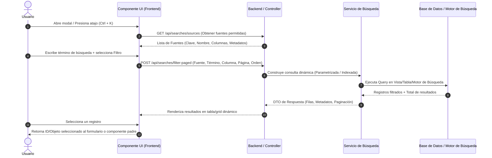

# Guía de Arquitectura e Implementación: Módulo de Búsqueda Global / Universal

Esta guía proporciona la especificación técnica, arquitectura y el paso a paso agnóstico (independiente del lenguaje de programación o framework) para diseñar e implementar un **Módulo de Búsqueda Global (o Universal)** en cualquier sistema de software moderno desde cero.

---

## 📋 1. ¿Qué es el Módulo de Búsqueda Global y Cómo Funciona?

El **Módulo de Búsqueda Global** es una solución desacoplada y centralizada que permite a los usuarios buscar, filtrar, consultar y seleccionar información proveniente de múltiples entidades o fuentes de datos del sistema (por ejemplo: Clientes, Proveedores, Proyectos, Contratos, Empleados, Servicios, etc.) desde una interfaz unificada (modal, buscador emergente o barra superior).

### 🔄 Flujo General de Funcionamiento



---

## 🛠️ 2. Requisitos Técnicos y Prerrequisitos

Para implementar este módulo con éxito, se requieren ciertos pilares en la infraestructura del proyecto:

### A. Capa de Base de Datos / Persistencia
1. **Estructuras de Lectura Optimizadas**:
   - **Opción Recomendada (SQL)**: Vistas de Base de Datos especializadas para búsqueda (ej. `vw_search_customers`, `vw_search_contracts`) que consoliden información relevante y eviten múltiples `JOIN` complejos en tiempo de ejecución.
   - **Opción Motores Dedicados**: Si el volumen de datos es muy alto, un motor de búsqueda como Elasticsearch, Meilisearch, OpenSearch o PostgreSQL Full-Text Search / PG-Trigram.
2. **Índices de Coincidencia**: Índices B-Tree en columnas clave de búsqueda (Código, RUC/RFC, Nombre, Correo) para garantizar respuestas menores a 100ms.

### B. Capa de Backend (Lógica de Negocio y API)
1. **Catálogo/Registro de Fuentes (Metadata Registry)**: Un diccionario central que mapea la clave de la fuente (ej. `"CUSTOMERS"`) con su estructura de datos, tabla/vista real y columnas permitidas para filtrar.
2. **Generador Dinámico de Consultas Seguro (Query Builder)**: Mecanismo para construir condiciones de filtrado (`WHERE column LIKE %value%` o equivalente NoSQL/SearchEngine) sanitizando y parametrizando de forma segura contra **SQL Injection**.
3. **Control de Acceso / Permisos**: Interceptor o Middleware que garantice que el usuario solo pueda listar/buscar en las fuentes para las cuales posee permisos asignados.

### C. Capa de Frontend (Interfaz de Usuario)
1. **Componente Reutilizable (Modal / Popover)**: Un componente independiente capaz de renderizarse sobre cualquier pantalla.
2. **Mecanismo de Debounce**: Retardo (ej. 300ms a 400ms) al capturar el evento de escritura del usuario para evitar saturar el backend con peticiones HTTP innecesarias por cada tecla presionada.
3. **Mapeador Dinámico de Tablas**: Capacidad de generar encabezados y celdas dinámicamente según los metadatos de columnas enviados por la API.

---

## 📐 3. Definición de Contratos de Datos (DTOs / JSON Schemas)

Los contratos de comunicación entre Frontend y Backend deben ser genéricos y extensibles.

### 3.1. Metadatos de la Fuente (`SearchSourceMetadata`)
Describe la estructura y capacidades de búsqueda de una entidad particular.

```json
{
  "key": "CUSTOMERS",
  "displayName": "Clientes y Razones Sociales",
  "keyColumn": "id_customer",
  "columns": [
    { "name": "id_customer", "displayName": "ID", "type": "Integer", "isSearchable": false },
    { "name": "tax_id", "displayName": "RFC / RUC", "type": "Text", "isSearchable": true },
    { "name": "full_name", "displayName": "Nombre / Razon Social", "type": "Text", "isSearchable": true },
    { "name": "email", "displayName": "Correo Electrónico", "type": "Text", "isSearchable": true }
  ]
}
```

### 3.2. Petición de Búsqueda Paginada (`PagedSearchRequest`)

```json
{
  "sourceKey": "CUSTOMERS",
  "searchColumn": "full_name",
  "searchText": "Palma",
  "matchOption": "Contains",
  "page": 1,
  "pageSize": 15,
  "sortColumn": "full_name",
  "sortDirection": "ASC"
}
```

> **Opciones de Match (`matchOption`)**:
> - `Contains`: Coincidencia parcial (`%texto%`).
> - `StartsWith`: Empieza con (`texto%`).
> - `EndsWith`: Termina en (`%texto`).
> - `Exact`: Coincidencia exacta (`= texto`).

### 3.3. Respuesta de Búsqueda Paginada (`PagedSearchResponse`)

```json
{
  "source": {
    "key": "CUSTOMERS",
    "displayName": "Clientes y Razones Sociales",
    "keyColumn": "id_customer",
    "columns": [...]
  },
  "pagination": {
    "currentPage": 1,
    "pageSize": 15,
    "totalRows": 142,
    "totalPages": 10
  },
  "rows": [
    {
      "id_customer": 101,
      "tax_id": "GPR900101ABC",
      "full_name": "GRUPO PALMA DE CORTEZ S.A. DE C.V.",
      "email": "contacto@grupopalma.com"
    }
  ],
  "warning": null
}
```

---

## 🚀 4. Guía de Implementación Paso a Paso

### Paso 1: Diseñar la Capa de Datos (Base de Datos)
Crea vistas o estructuras estandarizadas para cada entidad buscable. Aísla la complejidad de las tablas maestras mediante una vista optimizada de lectura.

**Ejemplo de patrón SQL:**
```sql
CREATE VIEW vw_search_customers AS
SELECT 
    c.id AS id_customer,
    c.tax_identifier AS tax_id,
    CONCAT(c.first_name, ' ', c.last_name) AS full_name,
    c.email AS email,
    c.is_active AS is_active
FROM tbl_customers c
WHERE c.is_deleted = 0;
```

---

### Paso 2: Construir el Registro Central de Fuentes en Backend
Define una estructura o patrón de diseño **Registry / Factory** en tu lenguaje de backend (Node.js, Python, Java, C#, Go, PHP, etc.) que contenga la declaración de cada entidad buscable.

**Pseudocódigo backend del Registro:**
```text
CLASE SearchSourceConfig:
    PROPIEDAD Key: String
    PROPIEDAD DisplayName: String
    PROPIEDAD TableOrViewName: String
    PROPIEDAD KeyColumn: String
    PROPIEDAD Columns: Lista<SearchColumnMetadata>
    PROPIEDAD RequiredPermission: String

CLASE SearchRegistry:
    DICCIONARIO sources

    METODO RegistrarFuente(config):
        sources[config.Key] = config

    METODO ObtenerFuente(key):
        RETORNAR sources[key]

    METODO ListarFuentesPermitidasParaUsuario(usuario):
        RETORNAR fuentes donde usuario.TienePermiso(fuente.RequiredPermission)
```

---

### Paso 3: Implementar el Servicio de Búsqueda Dinámico (Backend)
El servicio recibe la petición paginada, valida los parámetros contra la configuración registrada de la fuente y ejecuta la consulta parametrizada.

**Reglas de Seguridad y Rendimiento:**
1. **Validación de Nombres de Columnas**: NUNCA concatenar columnas recibidas directamente del frontend en la consulta SQL. Valida siempre que `searchColumn` y `sortColumn` existan dentro de la lista de metadatos de la fuente permitida.
2. **Consultas Parametrizadas**: El valor de `searchText` DEBE pasarse como un parámetro seguro del motor de base de datos o consulta.
3. **Conteo Total**: Ejecuta una consulta de conteo (`COUNT(*)`) para calcular la paginación de forma precisa.

**Algoritmo Pseudocódigo del Servicio:**
```text
METODO FiltrarBusquedaPaginada(solicitud):
    fuente = SearchRegistry.ObtenerFuente(solicitud.sourceKey)
    SI fuente NO EXISTE O usuario NO TIENE PERMISO:
        LANZAR ExcepcionAccesoDenegado()

    // Validar columna de búsqueda
    columnaBuscable = ValidarColumna(fuente, solicitud.searchColumn)

    // Construir condición según el MatchOption
    patronBusqueda = FormatearPatron(solicitud.matchOption, solicitud.searchText)

    // Ejecutar Query Parametrizada
    filas = BaseDatos.EjecutarQueryPaginada(
        tabla = fuente.TableOrViewName,
        columnaFiltro = columnaBuscable,
        patron = patronBusqueda,
        columnaOrden = solicitud.sortColumn,
        direccionOrden = solicitud.sortDirection,
        pagina = solicitud.page,
        tamanoPagina = solicitud.pageSize
    )

    totalFilas = BaseDatos.EjecutarConteoTotal(...)

    RETORNAR PagedSearchResponse(fuente, paginacion, filas)
```

---

### Paso 4: Implementar los Endpoints/Rutas API
Expón los endpoints necesarios para alimentar la interfaz gráfica:

| Método HTTP | Ruta / Endpoint | Descripción |
| :--- | :--- | :--- |
| `GET` | `/api/searches/sources` | Obtiene el catálogo de fuentes disponibles según los permisos del usuario logueado. |
| `POST` | `/api/searches/filter-paged` | Realiza el filtrado paginado de una fuente específica. |
| `POST` | `/api/searches/selection` | (Opcional) Valida y procesa la selección de una fila. |

---

### Paso 5: Desarrollar el Componente UI (Frontend Modal / Universal Picker)

El frontend requiere un componente UI reactivo e independiente (Modal de Búsqueda Universal).

#### Estructura Visual del Modal:

```
+-------------------------------------------------------------------------+
| Búsqueda Universal / Selector Global                                [X] |
+-------------------------------------------------------------------------+
| Fuente: [ Seleccionar Entidad (ej. Clientes) v ]                       |
| Buscar en: [ Columna (ej. Nombre) v ] Coincidencia: [ Contiene v ]      |
| Texto:   [ Escriba para buscar...                        ] [Buscar]     |
+-------------------------------------------------------------------------+
| ID   | RFC / RUC     | Nombre / Razón Social         | Correo          |
+------+---------------+-------------------------------+-----------------+
| 101  | GPR900101ABC  | GRUPO PALMA S.A. DE C.V.      | info@gpalma.com |
| 102  | ABC800202XYZ  | COMERCIOS UNIDOS S.A.         | ventas@cusa.com |
+-------------------------------------------------------------------------+
| < Anterior  Página 1 de 10  Siguiente >       Total de registros: 142   |
+-------------------------------------------------------------------------+
```

#### Requisitos Lógicos del Componente Frontend:
1. **Props / Parámetros de Entrada**:
   - `initialSource`: (Opcional) Fuente preseleccionada si se invoca para un campo concreto.
   - `visible`: Booleano para mostrar/ocultar el modal.
2. **Eventos / Salidas**:
   - `onSelect(rowObject)`: Emite la fila o ID completo seleccionado hacia la pantalla que invocó el modal.
   - `onCancel()`: Emite el evento de cierre.
3. **Control Debounce**:
   - Implementar un temporizador al modificar el campo `searchText` para no ejecutar la búsqueda inmediatamente en cada `keydown`.

---

### Paso 6: Integración del Módulo en Pantallas de la Aplicación

Cualquier formulario que requiera seleccionar una entidad (por ejemplo, asignar un cliente en la creación de un contrato) puede invocar el Módulo de Búsqueda Global.

#### Patrón de Integración en Formularios:

```text
[ Campo: Cliente Seleccionado: "GRUPO PALMA S.A. DE C.V." ]  [ 🔍 Buscar Cliente ]

AL PRESIONAR BOTÓN [🔍 Buscar Cliente]:
    ModalBusquedaGlobal.abrir(fuente = "CUSTOMERS", alSeleccionar = (cliente) => {
        formulario.cliente_id = cliente.id_customer
        formulario.cliente_nombre = cliente.full_name
    })
```

---

## 🔒 5. Consideraciones de Seguridad y Buenas Prácticas

1. **Prevención de SQL Injection / NoSQL Injection**:
   - Nunca confíes en cadenas enviadas desde el cliente para nombres de tablas o columnas. Valídalas siempre contra una lista blanca (*whitelist*) definida en el servidor.
2. **Principio de Mínimo Privilegio (Seguridad de Datos)**:
   - Filtra los resultados en el backend según el contexto del usuario autenticado (ej. multi-inquilino/multi-tenant, sucursal o roles).
3. **Sanitización de Datos de Salida**:
   - Asegúrate de escapar los datos renderizados en la UI para prevenir ataques de Cross-Site Scripting (XSS).
4. **Límite de Paginación Máximo**:
   - Restringe el tamaño máximo de página (`pageSize` máx. 100) en el backend para evitar sobrecargar la memoria del servidor.
5. **Atajos de Teclado Globales**:
   - Ofrece una gran experiencia de usuario habilitando atajos como `Ctrl + K` o `Cmd + K` para abrir el buscador universal desde cualquier lugar del sistema.

---

## 📌 6. Resumen de CheckList de Implementación

- [ ] **Fase 1: BD**: Crear vistas de búsqueda (`vw_search_*`) e índices en columnas clave.
- [ ] **Fase 2: Backend**: Implementar el Registro de Fuentes (`SearchRegistry`) con whitelists de columnas.
- [ ] **Fase 3: Backend**: Crear los DTOs y el servicio de consulta dinámica parametrizada.
- [ ] **Fase 4: Backend**: Exponer los endpoints REST/GraphQL protegidos por seguridad.
- [ ] **Fase 5: Frontend**: Desarrollar el componente Modal reutilizable con Paginador, Debounce y Renderizado Dinámico de Columnas.
- [ ] **Fase 6: Integración**: Conectar el modal a las pantallas y formularios del sistema mediante eventos o callbacks.
