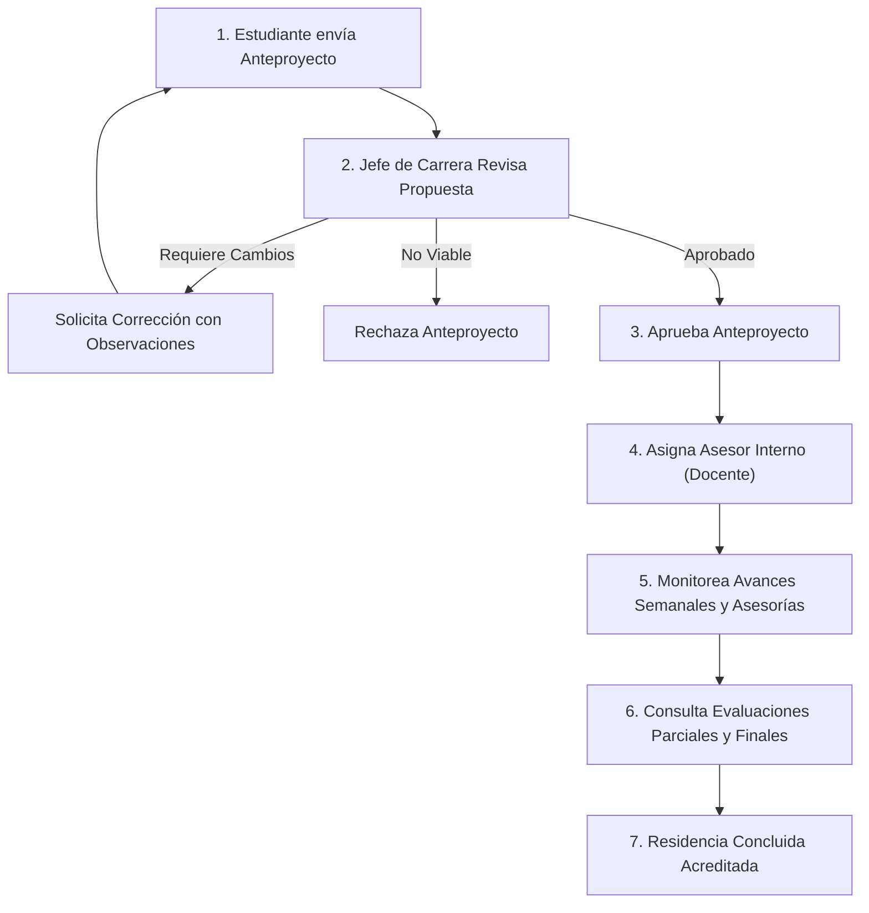

# 📘 Guía Operativa: Rol Jefe de Carrera (Coordinador Académico)
**Tecnológico Nacional de México — Instituto Tecnológico de Monclova**  
*Sistema Integral de Gestión de Residencias Profesionales (TecNM Residencias v2)*

---

## 1. Propósito y Filosofía del Rol

El rol de **Jefe de Carrera** está diseñado para los coordinadores académicos y directores de departamento de cada carrera. Su función principal es el **control académico, dictaminación de proyectos, asignación de asesores y aseguramiento de la calidad académica** de las residencias profesionales de sus estudiantes.

> [!IMPORTANT]
> **Principio de Aislamiento por Carrera**:  
> Cada Jefe de Carrera tiene acceso **estricto y exclusivo** a los estudiantes, proyectos, asesores y expedientes pertenecientes a **su propia carrera**. El sistema filtra automáticamente toda la información para proteger la privacidad y organización departamental.

---

## 2. 🟢 Lo que SÍ PUEDE HACER el Jefe de Carrera

### A. Gestión de Anteproyectos y Residencias
1. **Revisión y Dictamen de Anteproyectos**:
   * Consultar todos los anteproyectos de residencia enviados por estudiantes de su carrera.
   * **Aprobar**: Valida que el proyecto cumple con los lineamientos académicos del TecNM.
   * **Solicitar Correcciones**: Retroalimentar al alumno con observaciones puntuales para que corrija su propuesta.
   * **Rechazar**: En caso de que el proyecto no sea viable o no cumpla los objetivos del plan de estudios.
2. **Asignación de Asesores Académicos**:
   * Asignar un **Docente Asesor Interno** a cada proyecto aprobado.
   * Reasignar asesor si existe sobrecarga de trabajo docente o causas justificadas.
   * Monitorear la carga máxima de residentes asignados a cada profesor de su departamento.

### B. Seguimiento Académico y Expedientes
3. **Cronograma y Avance de Actividades**:
   * Consultar el cronograma oficial de 16 semanas cargado por los estudiantes.
   * Revisar los reportes semanales de actividades y el estado de validación por parte del asesor.
4. **Supervisión de Sesiones de Asesoría**:
   * Ver las bitácoras y registros de las asesorías brindadas por los docentes a sus estudiantes.
   * Consultar evidencias de reuniones presenciales o virtuales.
5. **Consulta de Evaluaciones y Calificaciones**:
   * Ver el desglose de calificaciones del primer parcial, segundo parcial y evaluación final emitidas por el asesor interno y asesor externo.
   * Consultar el estatus de acreditación de la residencia.
6. **Expediente Digital del Estudiante**:
   * Acceder a los documentos cargados por el alumno (Solicitud de Residencia, Carta de Aceptación, Reportes Parciales, Reporte Final).

### C. Directorio y Padrón Estudiantil
7. **Padrón de Estudiantes de su Carrera**:
   * Consultar la lista integral de alumnos de su carrera registrados en el sistema.
   * Registrar individualmente a un nuevo alumno (se asociará automáticamente a su carrera).
   * Importar masivamente alumnos mediante plantilla Excel (quedan vinculados a su carrera).
8. **Consulta de Empresas**:
   * Explorar el catálogo de empresas e instituciones registradas donde los estudiantes están haciendo o pueden hacer residencia.

---

## 3. 🔴 Lo que NO PUEDE HACER el Jefe de Carrera (Límites Operativos)

| Acción Restringida | ¿Quién tiene la facultad? | Motivo de la Restricción |
|---|---|---|
| **Ver o editar estudiantes/proyectos de otras carreras** | Su respectivo Jefe de Carrera o Administrador | Regla de aislamiento institucional y confidencialidad. |
| **Emitir o asentar calificaciones numéricas** | Asesor Interno y Asesor Externo | La evaluación técnica corresponde a los tutores asignados al proyecto. |
| **Generar y emitir Cartas de Presentación Oficiales** | Depto. de Gestión Tecnológica y Vinculación | Es un trámite administrativo externo oficial institucional. |
| **Dar de alta o validar nuevas Empresas en el catálogo** | Depto. de Vinculación / Administrador | Vinculación es responsable de verificar RFC, convenios y estatus legal de empresas. |
| **Crear, editar o eliminar Roles y Permisos de usuarios** | Super Administrador | Protección de seguridad y control de acceso al sistema. |
| **Eliminar estudiantes con historial o proyectos activos** | Super Administrador | Prevenir pérdida de evidencia para auditorías del TecNM / CACEI. |
| **Modificar la configuración del sistema o formatos oficiales** | Super Administrador | Mantener la uniformidad institucional de los formatos aprobados. |

---

## 4. 🔄 Flujo de Trabajo Típico del Jefe de Carrera

### Detalle de Fases:

1. **Fase de Recepción (Inicio de Periodo)**:
   * Entrar a **Proyectos > Revisión de Anteproyectos**.
   * Leer el título, justificación, objetivos general/específicos y datos de la empresa.
   * Dictaminar (Aprobar o Requerir Ajustes).

2. **Fase de Asignación de Asesor**:
   * En proyectos aprobados, hacer clic en **Asignar Asesor**.
   * Seleccionar un docente de la lista de profesores de su academia cuidando no sobrepasar el límite de asesorados recomendados por docente.

3. **Fase de Monitoreo Semanal (Durante el Semestre)**:
   * Supervisar que el alumno suba su cronograma en las primeras semanas.
   * Monitorear en **Seguimiento y Asesorías** que los asesores lleven al menos las sesiones requeridas reglamentariamente.

4. **Fase de Cierre (Fin de Semestre)**:
   * Verificar en **Evaluaciones** que estén registradas las calificaciones del reporte final y las actas correspondientes.
   * Confirmar la carga del Reporte Final en formato PDF en el expediente digital.

---

## 5. ❓ Preguntas Frecuentes (FAQ)

### ¿Por qué no me aparecen alumnos de otra ingeniería?
Porque el rol de Jefe de Carrera está aislado por diseño. Solo el Administrador general y Vinculación tienen visibilidad de todas las carreras simultáneamente.

### ¿Puedo cambiarle el asesor a un estudiante a mitad de semestre?
Sí. Desde la vista de asignación de asesores puedes reasignar a otro docente de tu departamento si el asesor original presenta incapacidad, sobrecarga o permiso académico.

### ¿Qué hago si un anteproyecto tiene errores ortográficos o técnicos?
Utiliza la opción **"Solicitar Correcciones"**. Escribe detalladamente qué debe mejorar el alumno. El estudiante recibirá una notificación por correo electrónico y el anteproyecto volverá a aparecerte una vez corregido.

### ¿Puedo registrar alumnos mediante Excel?
Sí, en **Directorio de Estudiantes > Importar Alumnos**. Al subir el archivo, el sistema validará los datos y los asignará automáticamente a tu carrera.

---
*Documento oficial de lineamientos de usuario — TecNM Residencias v2.*
