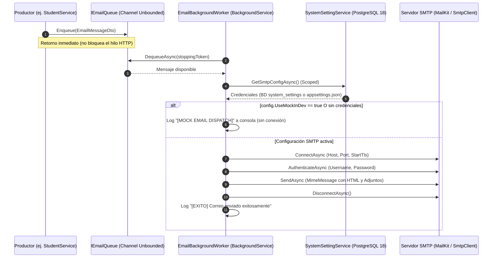

# 10 - Email Notification and Dispatch Service Specification (Backend C# .NET 10 + MailKit)

Module: `Common/Notifications/` & `Common/Settings/`  
Domain: Asynchronous Email Dispatch, Transactional Mail Templates & SMTP Configuration  
Tech Stack: **C# .NET 10** (ASP.NET Core Web API), **MailKit 4.11+**, **MimeKit**, **System.Threading.Channels**, **PostgreSQL 18**

---

## 1. Arquitectura y Componentes Colocalizados

El subsistema de correos electrónicos está implementado bajo un patrón productor-consumidor asíncrono y desacoplado, utilizando canales nativos de alto rendimiento de .NET (`System.Threading.Channels`) y un servicio alojado en segundo plano (`BackgroundService`).

### 1.1 Archivos Principales

```
RTecNM_V2_Backend/
├── Common/
│   ├── Notifications/
│   │   ├── IEmailQueue.cs               # Interfaz del canal de mensajería asíncrono
│   │   ├── EmailQueue.cs                # Implementación en memoria mediante Channel<EmailMessageDto>
│   │   ├── EmailBackgroundWorker.cs     # Worker HostedService (consumidor en segundo plano)
│   │   ├── EmailMessageDto.cs           # Contratos de datos (EmailMessageDto y EmailAttachmentDto)
│   │   ├── EmailTemplateService.cs      # Motor de plantillas HTML responsivas institucionales TecNM
│   │   └── SmtpOptions.cs               # POCO para deserialización desde appsettings.json / variables de entorno
│   └── Settings/
│       ├── ISystemSettingService.cs     # Contrato para resolución de configuración dinámica
│       ├── SystemSettingService.cs      # Lógica de fallback BD (system_settings) -> appsettings.json
│       ├── SmtpConfigDto.cs             # DTO de configuración SMTP
│       └── SystemSettingsController.cs  # Endpoints administrativos para probar y configurar SMTP
```

---

## 2. Flujo de Envío (Productor - Canal - Consumidor)



### 2.1 Encolamiento (Productor)
- El productor invoca `IEmailQueue.Enqueue(emailMessage)`.
- El método valida que `ToEmail` no sea nulo ni vacío.
- Deposita el mensaje en `_queue.Writer.TryWrite(message)` en un `Channel<EmailMessageDto>` sin límite de capacidad (`UnboundedChannelOptions` con `SingleReader = true`).
- **Rendimiento**: Cero latencia en peticiones HTTP; la respuesta al cliente API no espera la negociación SMTP externa.

### 2.2 Desencolamiento y Procesamiento (Consumidor)
- `EmailBackgroundWorker` hereda de `BackgroundService`.
- Se ejecuta en bucle continuo `while (!stoppingToken.IsCancellationRequested)` consumiendo `await _queue.DequeueAsync(stoppingToken)`.
- En cada iteración crea un ámbito de dependencias (`_serviceProvider.CreateScope()`) para consultar `ISystemSettingService.GetSmtpConfigAsync()`. Esto permite aplicar cambios en credenciales SMTP de manera inmediata sin reiniciar el servidor.

---

## 3. Configuración Dinámica y Modo Mock

### 3.1 Jerarquía de Configuración
La configuración SMTP se resuelve mediante una jerarquía de dos niveles:
1. **Base de Datos (`system_settings`)**: Claves prefijadas con `smtp.` (`smtp.host`, `smtp.port`, `smtp.sender_name`, `smtp.sender_email`, `smtp.username`, `smtp.password`, `smtp.enable_ssl`, `smtp.use_mock`).
2. **Fallback (`appsettings.json` o Variables de Entorno)**: Sección `SmtpSettings`.

### 3.2 Modo Simulación en Desarrollo (`UseMockInDev`)
- Si `config.UseMockInDev == true` o las credenciales (`Username`, `Password`) están en blanco:
  - El sistema **no** intenta abrir sockets SMTP contra servidores externos.
  - Imprime un log detallado en la consola:
    ```
    [MOCK EMAIL DISPATCH] Correo enviado simbólicamente en desarrollo:
      Para: juan.perez@monclova.tecnm.mx (Juan Perez)
      Asunto: Bienvenido al Sistema de Residencias Profesionales — TecNM Monclova
    ```
- Evita bloqueos por timeout en redes locales o de desarrollo sin credenciales configuradas.

---

## 4. Plantillas y Disparadores del Sistema

`EmailTemplateService` genera correos en HTML responsivo inline con tipografía Segoe UI y la paleta institucional TecNM (`#1B396A` Azul Marino, `#C5A059` Dorado):

| Plantilla | Disparador | Contenido | Archivos Adjuntos |
| :--- | :--- | :--- | :--- |
| **`BuildWelcomeEmail`** | `StudentService.CreateAsync`<br>`StudentService.ImportBatchAsync` | Notificación de alta de cuenta, credenciales iniciales (número de control como contraseña provisional) y botón CTA a login. | Ninguno |
| **`BuildPresentationLetterEmail`** | `StudentService.SendPresentationLetterAsync`<br>`StudentService.SendPresentationLettersBatchAsync` | Notificación oficial de trámite de residencia, datos del proyecto y empresa asignada. | `Carta_Presentacion_{controlNumber}.pdf` generado al vuelo en memoria (`byte[]`) |
| **`BuildLetterAvailableEmail`** | `DocumentService.UploadAsync` | Aviso al estudiante cuando un documento oficial (carta, dictamen, libranza) ha sido emitido y subido a su expediente. | Ninguno (redirecciona a expediente digital) |
| **`BuildBroadcastNotificationEmail`** | `NotificationService.CreateNotificationAsync` | Aviso institucional masivo para roles (estudiantes, asesores, académicos), carrera o modalidad, enviado en lotes con copia oculta. | Ninguno (botón CTA a la plataforma) |

---

## 5. Endpoints Administrativos (Gestión y Pruebas SMTP)

Ruta base: `api/v1/system-settings` (Protegida por rol `admin`):

- `GET /api/v1/system-settings/smtp`: Obtiene la configuración actual activa.
- `PUT /api/v1/system-settings/smtp`: Actualiza parámetros SMTP persistiendo en la tabla `system_settings`.
- `POST /api/v1/system-settings/smtp/test`: Envía un correo de prueba sincrónico al destinatario proporcionado para verificar conectividad, certificados TLS y autenticación con el servidor SMTP (ej. Office 365, Gmail Workspace).

---

## 6. Despacho Masivo por Lotes (BCC Chunks de 300) en Microsoft 365

Para notificaciones masivas emitidas desde el módulo académico (`NotificationService`), se implementa una estrategia de empaquetado en lotes:

1. **Restricciones de Cuota en Microsoft 365 (Exchange Online)**:
   - Tope por mensaje: **500 destinatarios** (`To` + `Cc` + `Bcc`).
   - Tasa de envío: **30 mensajes por minuto** vía SMTP AUTH.
   - Límite diario: **10,000 destinatarios por día**.

2. **Tamaño de Lote Seleccionado (300 Destinatarios)**:
   - Se procesan bloques de hasta **300 correos** en el campo `Bcc` (`MimeMessage.Bcc`).
   - El encabezado `To` se rotula con la etiqueta de audiencia grupal (ej. *"Estudiantes"*, *"Asesores"* o *"Toda la Comunidad TecNM"*).
   - Queda un 40% por debajo del límite duro de 500 de Microsoft, previniendo alertas heurísticas en Exchange Defender.

3. **Ventajas del Tenant Local (`@monclova.tecnm.mx`)**:
   - Al ser direcciones pertenecientes al mismo tenant de Office 365, el enrutamiento es interno y la entrega en buzones es inmediata.
   - No hay exposición pública de las direcciones de los destinatarios entre sí (privacidad garantizada).
   - Un aviso para 900 usuarios se despacha en solo **3 mensajes SMTP**, consumiendo solo el 10% de la cuota por minuto.

4. **Ejecución en Segundo Plano (`IServiceScopeFactory`)**:
   - `NotificationService.CreateNotificationAsync` persiste la notificación en BD y dispara la resolución de correos y encolamiento en un hilo no bloqueante (`_ = EnqueueBroadcastEmailsAsync(...)`) con su propio `IServiceScope` para garantizar aislamiento de `AppDbContext`.

5. **Exención de Carrera para Rol Dirección y Modo Pruebas Individual (`target_user_id`)**:
   - **Rol Dirección (`director`)**: Por naturaleza institucional, los directores no están ligados a una carrera específica. El repositorio y el servicio de notificaciones ignoran el filtro de carrera para este rol, asegurando que reciban avisos institucionales sin ser bloqueados por `career_id`.
   - **Modo Pruebas Unitario (`target_user_id`)**: Permite seleccionar a un usuario específico mediante autocompletado (`GET /api/v1/notifications/user-options`). La notificación y el correo se envían exclusivamente a su buzón institucional, omitiendo agrupaciones de rol o carrera.


